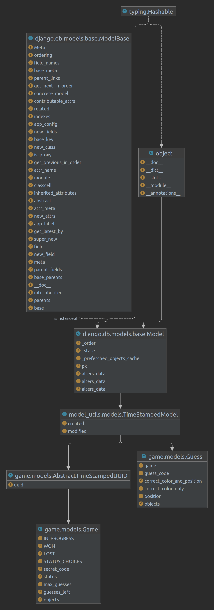

# inari

inari Mastermind

The project runs using Django along with Django Rest Framework and PostgreSQL as the database. Currently, the project is using the Django server for convenience.
However, to put it into production, another server like gunicorn should be used.

## Prerequisites

* Docker and Docker Compose need to be installed to run the project locally.
* Before starting, you need to create the **.env** file by duplicating the **.env.local** file.
* Ports **8086** and **5452** must be available for Django and the database to start. If they are occupied, they can be changed in the Docker Compose.

## Starting

To start the project, you just need to be in the directory and run `make local.start`.

Once the project is running, Swagger is installed, and you can test it using the interface. The path is http://localhost:8086/swagger.

## Running Tests

The tests work using pytest. To run them, you have to enter the container using the command: `docker exec -it inari bash`.

Once inside, run the command `pytest`.

## Questionnaire
Also, to retrospect with the code of the project, some questions:
* What is your favorite package manager and why? Nowadays my favorit package manager is poetry. Because it works efficiently and correctly locks deep dependencies. I use a lot in the past pyenv but it had performance problems. (I know pyenv had a lot of improvements at last time.)
* What architecture did you follow for this project? I use the typical architecture of Django with DRF. It has their apps and It is based on an MVT pattern. I used managers to create the objects.
* Do you know and understand UML? Yes, I know. What would the class diagram of the domain exposed in the mastermind game be like for you? I like a similar uml like this: 
* What tools are you aware of to handle things like code styling and consistency,
formatting, typing...? PEP8 with Flake8, black to auto format, typing (mypy)
* Is there anything you would like to comment about the project, this small exercise,
etc? My code is using the runserver of django, but in production it should use another server like gunicorn.
